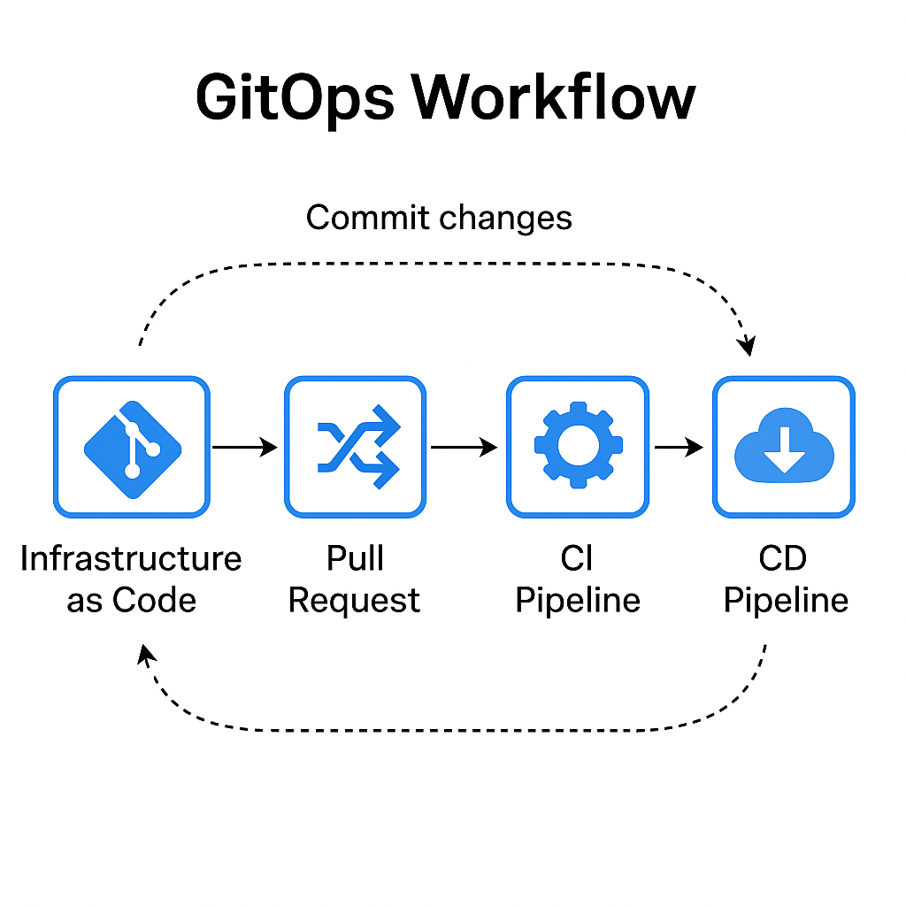

# GitOps

Infrastructure as Code (IaC), implemented via Git (including server/repository systems), also referred to as XaC, where X represent Infrastructure, Security, Policy, Network or Configuration, is utilized within a source code management platform to foster collaboration among individuals and teams, thereby enhancing the quality of infrastructure and application landscapes.
    
## Set-Up (minimum requirements)

1. Clean (OS) installation of Linux
2. Set-up "root" user
3. ssh keys installation (manual/automatic)
4. sudo dnf install git
5. sudo dnf install ansible
6. git init and create repo 

## GitOps workflow

